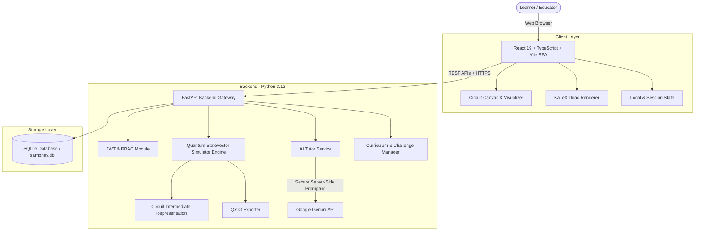

<div align="center">

# ⚛️ SAMBHAV

### **AI-Powered Interactive Quantum Algorithm Learning Platform**

[](https://www.sih.gov.in/)
[](https://sambhav-quantum-app.web.app/)
[](https://sambhav-tawny.vercel.app/)
[](LICENSE)

[](https://react.dev/)
[](https://fastapi.tiangolo.com/)
[](https://ai.google.dev/)
[]()

---

[🌐 **Live Demo**](https://sambhav-quantum-app.web.app/) • [🎯 **Problem Statement**](#-problem-statement) • [✨ **Key Features**](#-key-features) • [🏗️ **Architecture**](#️-system-architecture) • [🛠️ **Tech Stack**](#️-technology-stack) • [⚡ **Quick Start**](#-quick-start) • [📡 **API Reference**](#-core-api-endpoints) • [👥 **Team**](#-team--credits)

---

</div>

## 📖 Overview

**SAMBHAV** is an end-to-end, browser-based quantum computing learning and experimentation ecosystem. Designed to bridge the steep learning curve between abstract mathematical theory and physical quantum systems, SAMBHAV enables learners and educators to build quantum circuits visually, simulate quantum states in real-time, explore fundamental quantum algorithms, and receive contextual assistance from an integrated **AI Quantum Tutor**.

Instead of requiring expensive hardware access or heavy local development environments, SAMBHAV provides an instant, interactive platform accessible to anyone with a web browser.

---

## 🎯 Problem Statement

* **Hackathon:** Smart India Hackathon (SIH) 2026
* **Problem Statement ID:** 26140
* **Title:** AI-Based Interactive Quantum Algorithm Learning Platform
* **Category:** Software
* **Theme:** Smart Automation

### The Challenge
Quantum computing concepts—such as multi-qubit superposition, entanglement, phase kickback, quantum interference, and unitary transformations—are mathematically rigorous and highly abstract. Traditional learning platforms are predominantly textbook-oriented with steep barriers to entry, lacking real-time visual feedback and guided debugging.

### The SAMBHAV Solution
SAMBHAV resolves this educational gap by offering a cohesive suite that combines:
1. **Visual Circuit Modeling** with live syntax validation and gate transformations.
2. **Statevector Simulation Engine** capable of calculating exact amplitudes, phases, and measurement distributions.
3. **Multi-Dimensional Quantum Visualizations** including 3D Bloch Spheres, Dirac notation renders, and probability histograms.
4. **Server-Side AI Copilot** powered by Google Gemini for contextual explanations and circuit debugging.
5. **Full Instructor Workspace** with cohort tracking, custom lab builders, and analytics.

---

## ✨ Key Features

### ⚛️ 1. Interactive Quantum Circuit Builder
* **Drag-and-Drop Canvas:** Seamlessly place single-qubit and multi-qubit gates on quantum registers up to 8 qubits.
* **Extensive Gate Library:**
  * **Single-Qubit Gates:** Hadamard ($H$), Pauli-$X$, Pauli-$Y$, Pauli-$Z$, Phase ($S$, $T$)
  * **Parametric Rotation Gates:** $R_x(\theta)$, $R_y(\theta)$, $R_z(\theta)$
  * **Multi-Qubit Entangling Gates:** Controlled-NOT ($CX$), Controlled-$Z$ ($CZ$), $SWAP$
* **Validation & Code Export:** Instant circuit validation with direct export to **Qiskit**, **OpenQASM**, and native **CircuitIR JSON**.

### 🧮 2. Custom Quantum Simulation Engine
* High-performance Python-based **statevector simulator** ($2^N$ complex state representation).
* Exact analytical state calculations alongside deterministic and probabilistic shot sampling.
* Calculates full density matrix elements, measurement probabilities, and quantum state phases.

### 🔬 3. Rich Quantum State Visualizations
* **3D Bloch Sphere:** Interactive single-qubit vector projection showing polar coordinates ($\theta, \phi$).
* **Statevector Amplitude & Phase Charts:** Color-coded phase wheel and magnitude distributions.
* **LaTeX / Dirac Notation:** Real-time mathematical state rendering ($|\psi\rangle = \alpha|0\rangle + \beta|1\rangle$) via KaTeX.
* **Measurement Histograms:** Visual bar charts for shot distribution analysis.

### 🧠 4. AI Quantum Tutor & Educator Copilot
* **Context-Aware Assistance:** Analyzes the active circuit state and provides plain-English breakdowns of quantum behaviors.
* **Intelligent Debugging:** Detects missing Hadamard gates, unentangled qubits, or phase alignment issues.
* **Dynamic Challenge Generator:** AI creates customized practice problems tailored to the learner's mastery level.
* **Zero Client Leakage:** API credentials are handled securely via server-side FastAPI endpoints.

### 🧪 5. Pre-Built Quantum Algorithm Library
Explore step-by-step reference implementations with full theoretical breakdowns:
* **Bell State Generation** ($|\Phi^+\rangle, |\Phi^-\rangle, |\Psi^+\rangle, |\Psi^-\rangle$)
* **GHZ State (Greenberger–Horne–Zeilinger)** ($3+$ qubit entanglement)
* **Superdense Coding** (Transmitting 2 classical bits with 1 qubit)
* **Quantum Teleportation Protocol**
* **Deutsch-Jozsa Algorithm** (Constant vs. balanced oracle evaluation)
* **Grover’s Search Algorithm** (Quadratic speedup search)
* **Quantum Phase Estimation (QPE)**

### 👨‍🏫 6. Instructor & Classroom Management Platform
* **Educator Dashboard:** Class-wide engagement metrics, challenge completion stats, and average scores.
* **Interactive Curriculum Builder:** Create custom lessons, modules, and interactive lab assignments.
* **Student Directory & Analytics:** Monitor individual student milestones and pinpoint learning roadblocks.
* **Live Student Preview:** Experience course content exactly as a student sees it before publishing.

### 🔐 7. Role-Based Access Control & Security
* Dedicated access profiles for **Students** and **Instructors**.
* Secure OTP-based login and session tokens via JWT.
* Robust cryptographic hashing (PBKDF2-HMAC-SHA256).

---

## 🏗️ System Architecture



---

## 🎓 The SAMBHAV Learning Journey


---

## 🛠️ Technology Stack

| Domain | Technology | Purpose |
| :--- | :--- | :--- |
| **Frontend Framework** | React 19 + TypeScript | High-performance, reactive UI architecture |
| **Build Tool** | Vite | Lightning-fast HMR and optimized production bundles |
| **Math Rendering** | KaTeX | High-speed client-side LaTeX and Dirac notation display |
| **Icons & UI** | Lucide React + Vanilla CSS | Modern, responsive, glassmorphism design system |
| **Backend Framework** | Python 3.12 + FastAPI | Async REST API with automatic OpenAPI documentation |
| **Quantum Engine** | Custom Statevector Simulator | Matrix-based state vector simulation ($2^N$) |
| **AI Intelligence** | Google Gemini API | Context-aware tutoring, challenge creation, circuit code reviews |
| **Data Storage** | SQLite / `sambhav.db` | Lightweight, zero-config relational database for courses, users, and progress |
| **Authentication** | JWT + PBKDF2-HMAC-SHA256 | Role-based authorization (Student / Instructor) |
| **Hosting (Client)** | Firebase Hosting | Scalable global CDN edge deployment |
| **Hosting (Server)** | Vercel Serverless | Serverless backend API runtime |

---

## 📂 Project Structure

```text
SAMBHAV/
├── frontend/                     # React 19 + TypeScript Frontend application
│   ├── public/                   # Static assets, icons, and manifests
│   ├── src/
│   │   ├── api/                  # Backend REST API client bindings
│   │   ├── components/           # Reusable UI components & modals
│   │   ├── context/              # React Context providers (Auth, Theme)
│   │   ├── data/                 # Course curriculums & preloaded algorithms
│   │   ├── features/
│   │   │   ├── ai-tutor/         # AI Quantum Tutor floating panel & prompts
│   │   │   ├── circuit-builder/  # Quantum circuit canvas & gate drag-and-drop
│   │   │   ├── instructor/       # Instructor dashboard & lesson builder
│   │   │   ├── learning/         # Interactive lessons, courses, and quizzes
│   │   │   └── visualization/    # 3D Bloch sphere, statevector bars & Dirac renderers
│   │   ├── pages/                # Top-level view routes
│   │   ├── styles.css            # Custom CSS design system
│   │   └── types.ts              # Global TypeScript interfaces
│   ├── package.json
│   └── vite.config.ts
│
├── backend/                      # Python FastAPI Backend
│   ├── app/
│   │   ├── api/                  # API routers (auth, simulation, AI, courses, instructor)
│   │   ├── auth/                 # JWT handlers, password hashing, and dependencies
│   │   ├── db/                   # Database connection and schema migrations
│   │   ├── quantum/              # Statevector simulation engine, gates, and CircuitIR
│   │   ├── services/             # Gemini AI service integration
│   │   └── main.py               # FastAPI entrypoint & middleware configuration
│   ├── tests/                    # Pytest test suites (simulation, auth, algorithms)
│   ├── requirements.txt          # Python backend dependencies
│   └── schema.sql                # SQL database initialization schema
│
├── docs/                         # Project documentation and specifications
├── docker-compose.yml            # Containerized setup configuration
├── start-dev.bat                 # Windows Command Prompt 1-click startup script
├── start-dev.ps1                 # Windows PowerShell 1-click startup script
└── README.md                     # Project documentation
```

---

## ⚡ Quick Start

### 📋 Prerequisites
* **Node.js** (v18.0 or newer) & **npm**
* **Python** (v3.12 or newer)
* **Git**

---

### Option 1: One-Click Development (Windows)

Launch both Frontend and Backend concurrently with one command:

```powershell
# Using PowerShell
.\start-dev.ps1
```

```cmd
:: Using Command Prompt
start-dev.bat
```

---

### Option 2: Manual Step-by-Step Setup

#### 1. Clone the Repository
```bash
git clone https://github.com/pnukadas-cloud/SAMBHAV.git
cd SAMBHAV
```

#### 2. Backend Setup
```bash
# Navigate to backend directory
cd backend

# Create and activate virtual environment
python -m venv .venv

# On Windows:
.venv\Scripts\activate
# On Linux / macOS:
# source .venv/bin/activate

# Install dependencies
pip install -r requirements.txt

# Create .env file (see Environment Variables section below)
# Start the FastAPI development server
python -m uvicorn app.main:app --reload --host 127.0.0.1 --port 8000
```
> The API will be running at: **`http://127.0.0.1:8000`**  
> Interactive Swagger API docs: **`http://127.0.0.1:8000/docs`**

#### 3. Frontend Setup
Open a new terminal window:
```bash
# Navigate to frontend directory
cd frontend

# Install npm packages
npm install

# Start Vite development server
npm run dev
```
> The application will be accessible at: **`http://127.0.0.1:5173`**

---

## 🔑 Environment Variables

Create a `.env` file in the `backend/` directory or project root:

```env
# Database
DATABASE_URL=sqlite:///sambhav.db

# Authentication
JWT_SECRET_KEY=sambhav_quantum_production_secret_key_2026_dev_env

# AI Tutor (Google Gemini)
GEMINI_API_KEY=your_gemini_api_key_here

# Server Port
PORT=8000

# Frontend Configuration (.env in frontend/)
VITE_API_URL=http://127.0.0.1:8000
```

> [!NOTE]
> `GEMINI_API_KEY` is exclusively consumed on the backend server. It is never exposed or sent to the client browser.

---

## 📡 Core API Endpoints

| Category | Method | Endpoint | Description | Auth Required |
| :--- | :--- | :--- | :--- | :---: |
| **Simulation** | `POST` | `/api/simulations/run` | Executes CircuitIR statevector simulation | Optional |
| **AI Tutor** | `POST` | `/api/ai/explain` | Generates AI explanation for a quantum concept | Yes |
| **AI Tutor** | `POST` | `/api/ai/explain-circuit` | Contextual circuit breakdown and gate analysis | Yes |
| **AI Tutor** | `POST` | `/api/ai/generate-challenge`| Creates dynamic quantum circuit challenge | Yes |
| **AI Tutor** | `POST` | `/api/ai/debug-code` | Analyzes circuit errors and provides fixes | Yes |
| **Auth** | `POST` | `/api/auth/send-otp` | Dispatches verification OTP code | No |
| **Auth** | `POST` | `/api/auth/verify-otp` | Verifies OTP and returns JWT bearer token | No |
| **Courses** | `GET` | `/api/courses` | Retrieves list of available quantum modules | No |
| **Courses** | `GET` | `/api/courses/{id}` | Fetches detailed lessons for a course | No |
| **Challenges** | `GET` | `/api/challenges` | Lists all interactive circuit challenges | No |
| **Challenges** | `POST` | `/api/challenges/evaluate` | Automatically evaluates user solution against target | Yes |
| **Circuits** | `POST` | `/api/circuits/save` | Persists custom circuit to user profile | Yes |
| **Circuits** | `GET` | `/api/circuits/my-circuits` | Retrieves saved circuits for authenticated user | Yes |
| **Progress** | `GET` | `/api/progress/me` | Retrieves learner completion statistics | Yes |
| **Instructor** | `GET` | `/api/instructor/dashboard`| Fetches class metrics, analytics, and active cohorts | Instructor |
| **Instructor** | `GET` | `/api/instructor/students` | Retrieves student directory and progress | Instructor |

---

## 🧪 Testing

Run backend test suites using `pytest`:

```bash
cd backend
pytest -v
```

The test suites validate:
* Quantum engine mathematical correctness (state amplitudes, probabilities, normalization).
* Standard quantum gates ($H, X, Y, Z, CX, CZ, SWAP$) and phase calculations.
* Standard algorithms (Bell States, Deutsch-Jozsa, Grover's search).
* Role-based authorization, JWT expiration, and database integrity.

---

## 🌐 Deployment & Live Environments

| Component | Provider | Live URL | Status |
| :--- | :--- | :--- | :---: |
| **Frontend Application** | Firebase Hosting | [https://sambhav-quantum-app.web.app/](https://sambhav-quantum-app.web.app/) | 🟢 Active |
| **Backend API Gateway** | Vercel | [https://sambhav-tawny.vercel.app/](https://sambhav-tawny.vercel.app/) | 🟢 Active |

---

## ⚠️ Prototype Notes & Scope

* **Software-Based Simulation:** The current prototype uses an exact statevector simulation engine designed for rapid education (up to 8 qubits). Physical quantum hardware execution (QPU) can be attached via cloud quantum adapters.
* **Qiskit Integration:** Circuits can be exported directly to standard Qiskit Python scripts and OpenQASM 2.0 for execution on IBM Quantum systems.
* **Storage:** Development and hackathon staging utilizes SQLite for lightweight, self-contained deployment.

---

## 🔮 Future Roadmap

- [ ] **Cloud QPU Backends:** Integrate direct dispatch to IBM Quantum Experience, Amazon Braket, and Rigetti QPUs.
- [ ] **Quantum Error Correction (QEC):** Interactive modules for Shor code, Steane code, and Surface codes.
- [ ] **Quantum Machine Learning (QML):** Visualized parameterized quantum circuits (VQC) and Variational Quantum Eigensolvers (VQE).
- [ ] **Multiplayer Quantum Games:** Collaborative entanglement puzzles and quantum chess for younger learners.
- [ ] **Enterprise Institutional LMS:** LTI compliance for seamless integration into university LMS (Canvas, Blackboard, Moodle).

---

## 🏆 Smart India Hackathon 2026

* **Problem Statement ID:** `26140`
* **Title:** AI-Based Interactive Quantum Algorithm Learning Platform
* **Category:** Software
* **Theme:** Smart Automation
* **Project Name:** SAMBHAV

---

## 👥 Team & Credits

**Team Name:** Expectó Codüm  
**Lead Developer:** [Nukadasari Punith Venkat Sai](https://github.com/pnukadas-cloud)  

Developed with passion for making quantum computing education universally accessible, intuitive, and engaging.

---

## 📄 License

This project is licensed under the **MIT License** — see the [LICENSE](LICENSE) file for details.
